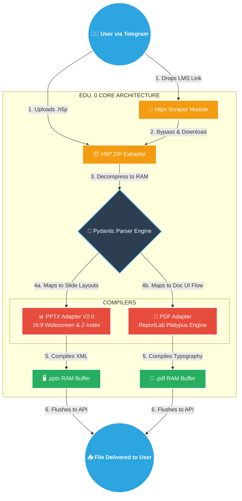

<div align="center">
 
# 🎓 EDU. 0 Engine 

<br>


**EDU. 0** is a high-performance, asynchronous Python bot engineered to extract raw interactive educational modules (`.h5p`) and dynamically compile them into beautifully formatted, 16:9 widescreen PowerPoint presentations and typography-rich PDF handouts. 

Built with a focus on modern UI/UX and robust software architecture, the engine operates entirely in RAM without writing temporary files to disk, ensuring lightning-fast conversions and strict data security.


---
</div>
## 🚀 Core Architecture & Features

* **Asynchronous Event Loop:** Built on `python-telegram-bot` v21+, utilizing non-blocking `asyncio` threads to handle multiple concurrent document compilations without server lag.
* **Advanced PPTX Engine V2.0:** * Replaces legacy 4:3 static layouts with dynamic 16:9 widescreen spatial math.
  * Implements a custom `H5PRichTextParser` (subclassed from `HTMLParser`) to translate web HTML tags directly into Microsoft XML runs.
  * Utilizes the Painter's Algorithm for Z-Index sorting, ensuring overlapping images and text blocks render flawlessly.
* **Platypus PDF Generation:** Leverages the ReportLab Platypus framework for fluid, dynamic document layouts, custom UI typography styles, and intelligent image auto-scaling.
* **LMS Web Scraper Fallback:** Includes an `httpx` networking module capable of catching `embed.php` URLs, rewriting them to exploit `export.php` endpoints, and scraping modules directly from protected environments.
* **Cloud-Native & Containerized:** Fully packaged within a `Dockerfile` including core LibreOffice dependencies, designed for zero-configuration deployment on platforms like Render or AWS Fargate.

---

## 🛠️ Technology Stack

| Component | Technology | Description |
| :--- | :--- | :--- |
| **Language** | Python 3.11 | Core logic and asynchronous runtime. |
| **Bot API** | `python-telegram-bot` | Telegram integration and Webhook/Polling management. |
| **Data Parsing** | `pydantic` | Strict type-checking and JSON schema validation. |
| **Presentation** | `python-pptx` | Programmatic PowerPoint XML manipulation. |
| **Document** | `reportlab` | Advanced PDF typography and layout engine. |
| **Networking** | `httpx` | High-speed, async HTTP client for the scraper module. |
| **Infrastructure**| Docker | OCI-compliant containerization for CI/CD pipelines. |

---

## 📂 Project Structure

```text
EDU_0_PROJECT/
├── app/
│   ├── main.py                 # Bot initialization, Handlers, and Health Check Sidecar
│   ├── domain/
│   │   └── parser.py           # Pydantic models & H5P ZIP extraction logic
│   └── infra/
│       ├── pdf_adapter.py      # ReportLab Platypus PDF compilation
│       ├── pptx_adapter.py     # 16:9 PPTX compilation & Rich Text Parser
│       └── scraper_adapter.py  # Async URL extraction & downloading
├── Dockerfile                  # Ubuntu-based Python & LibreOffice container
├── docker-compose.yml          # Local development orchestration
├── requirements.txt            # Python dependencies
└── README.md
```

## 💻 Local Development Setup

**Prerequisites**
* [**Docker Desktop**](https://docs.docker.com/desktop/setup/install/windows-install/) installed.
* A Telegram Bot Token from [**@BotFather**](https://t.me/BotFather).

**Installation Steps**

1 *Clone the repository:*
```
git clone https://github.com/NimnaOfficial/EDU.-0-project.git
cd edu-0-project
```
2 *Configure Environment Variables:*

Create a `.env` file in the root directory and add your token:
```
BOT_TOKEN=your_telegram_bot_token_here
```
3 *Build and Run the Container:*
```
docker-compose up -d --build
```

*The engine will download the base images, install LibreOffice dependencies, and boot the bot. Watch the logs using docker-compose logs -f to see the "EDU. 0 Engine is online" confirmation.*

## ☁️ Production Deployment (Render)

This application is designed for seamless CI/CD deployment on Render using a specialized Health Check Sidecar to bypass port-binding restrictions.

1. Connect this GitHub repository to Render as a **Web Service** (Docker Environment).
2. Under **Environment Variables**, add:
   * `BOT_TOKEN` : `your_telegram_bot_token_here`
   * `PORT` : `10000`
3. Set the **Start Command** to: `python main.py`
4. Deploy. The internal `BaseHTTPRequestHandler` will automatically ping Render on Port 10000 to keep the container alive while the asynchronous polling loop connects to Telegram.

---

## ⚙️ How It Works (The Pipeline)

1. **Ingestion:** User uploads a `.h5p` file or drops a valid LMS URL.
2. **Decompression:** `parser.py` intercepts the file in RAM, unzips the architecture, and maps the `h5p.json` tree against the `content/` binary assets.
3. **Compilation:** Based on user selection, the parsed Pydantic object is routed to the `PPTXBuilder` or `PDFBuilder`.
4. **Delivery:** The finished document buffer is flushed back to the Telegram API and delivered to the user with zero disk-write overhead.

---

## 🗺️ System Architecture

<p><em>Architected and engineered by Nimna.</em></p>
